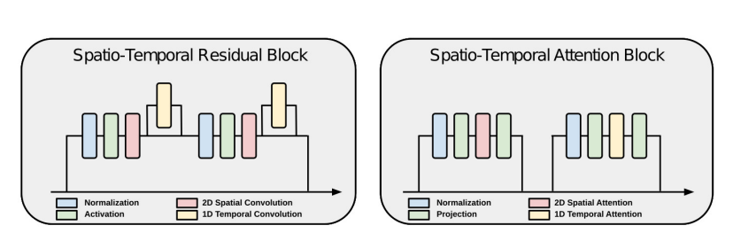
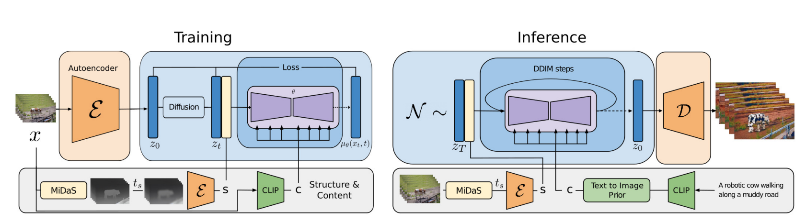
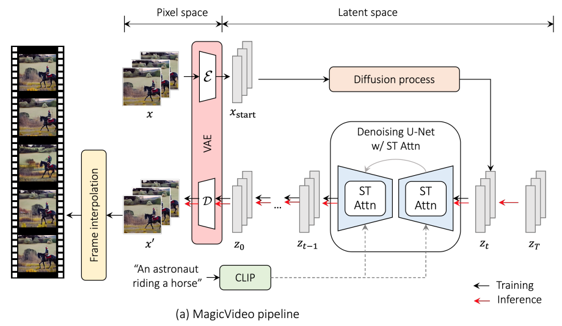
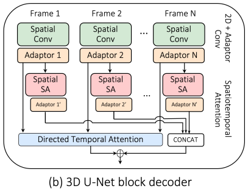
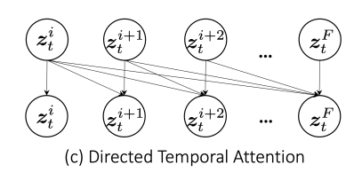

# **Video Generation**
This code repository is mainly for research and analysis in video generation. Currently, the code has not been uploaded as it is still being experimented on. The repository currently contains some summaries of my research and paper reading, as well as my own understanding and experimental ideas after learning and summarizing. If ideal results are achieved in the future, the code will be open-sourced.

# **Video Generation的难点**
视频生成是指使用计算机程序和人工智能技术来生成逼真、连续和自然的视频序列，其中**视频的连续性和一致性**是视频生成中一个重要的挑战，**时间依赖性**和**生成过程中的细粒度控制**也是其中的两个重要的挑战。

**视频的连续性和一致性**是指视频序列中相邻帧之间的平滑过渡和连续性，使得视频看起来自然和流畅。视频的连续性是视频生成中一个重要的挑战，因为生成的视频需要具有连续的运动和物体交互，同时还要保持视觉上的平滑和自然。为了保持视频的连续性，视频生成模型需要考虑时间序列数据的长期依赖性，并在生成过程中维护一致的运动和物体姿态。

# **如何解决上面的难点**
## [Structure and Content-Guided Video Synthesis with Diffusion Models](https://arxiv.org/pdf/2302.03011.pdf)

在这篇论文里面，主要基于扩散模型，该模型可以捕获视频中的时间依赖关系和复杂的数据分布，从而有效地进行视频合成；可以通过结构和内容的指导来生成更真实、更多样的视频，也能保证模型生成视频效果的一致性和连续性；再通过1D时间卷积和1D时间注意力操作学习帧与帧之间的时间依赖；在条件控制层面加入了CLIP的Image Embedding，从而在内容控制的时候，做到更加精细化细粒度的控制。

结构指导：首先，通过一个特定的结构图（例如，视频的场景图）来指导视频合成。这个结构图可以提供一些关于场景和对象的信息，从而帮助模型更好地生成场景和对象之间的关系。

内容指导：其次，利用一个编码器来将原始视频中的每一帧转换为一个低维向量表示，这个向量表示包含了视频的内容信息，包括场景、动作和人物等。这个编码器采用了一个预训练的图像分类模型，可以提高视频合成的准确性。

该篇里面具体实现的视频生成的功能，是需要一个source video，然后通过text prompt对source video 进行转换得到target video，这里的text prompt通过prior model将text embedding转换成image embedding，source video通过MiDaS转换成结构场景图，输入到模型中，得到最终的target video。即video-to-video

## [MagicVideo: Efficient Video Generation With Latent Diffusion Models](https://arxiv.org/pdf/2211.11018.pdf)

在这篇论文里面，也采用的是在latent space上进行扩散，从而提升训练和采样的效率。以下是论文提到的三个关键点：

1.提出了一种新的基于潜在扩散模型的文本到视频生成框架，称为MagicVideo。MagicVideo可以根据给定的文本输入生成高分辨率视频片段（256×256），速度非常可观。

2.我们提出了一种新的视频学习方案，可以处理视频帧，而无需3D卷积或2D空间卷积 + 1D时间卷积块来学习时间依赖性。相反，这里提出建议采用一种新颖的2D卷积 + 适配器块设计来处理视频数据，提出这种设计架构的直觉是基于观察，发现每个视频剪辑中的帧在语义上是相似的，因此采用专用的1D卷积层来说，帧之间的微小差异可能不是必需的。
$\color{red}{"2D卷积 + 适配器块设计"这一点是最吸引我的，我参加过一些建模的比赛，遇到过对序列建模的情况，其中采用3D卷积或者2D空间卷积 + 1D时间卷积块来建模的方法，极大拖慢训练的效率，当feature map size和channel数量比较大的时候，速度更是慢的令人发指；论文这里的模块设计给我一种建模视频序列的一种新的思路}$

$\color{green}{这里也给了我一些建模的启发，就是每一帧图像之间有时候差别不是很大，语意信息会很相似，那么是不是应该着重去学习，相邻帧之间的细节差异，反而能够更好的建模，具体是针对像素级别的差异，还是潜在空间的语义差异，亦或者是他们之间的感知差异。}$

3.引入了一种简单而有效的有向自注意力模块，可以从视频数据集中学习有意义的运动。我过实验证明，MagicVideo可以使用所提出的有向自注意力生成具有一致性的富有表现力的motion

# **其他难点**

**1.高维度输入：视频数据包含大量的像素值和时间序列信息，导致输入维度非常高。**

    视频是更高维度的图片，所以它的维度更高，所以要处理视频，它所面临的计算量将会更大。不过由于latent diffusion在图片领域的成功，大大降低了数据的维度，还能保证图片的生成质量；进而出现了以视频为基础的Video Diffusion，
[MagicVideo: Efficient Video Generation With Latent Diffusion Models](https://arxiv.org/pdf/2211.11018.pdf)

**2.数据丰富性：要生成具有自然、流畅的视频，需要模型具有丰富的数据知识，例如运动、光照等。**
    
    需要模型学习到足够丰富的视频数据的分布特点

**3.长期依赖性：视频是时间序列数据，要生成连续的视频需要模型具有处理长期依赖关系的能力。**

    基于序列的建模方法：将视频中的每一帧视为时间序列中的一个数据点，利用序列模型如循环神经网络（RNN）、长短时记忆网络（LSTM）等建立模型。这样，模型可以从前面的帧学习到时间依赖，从而提高预测的准确性。同时，RNN或LSTM模型也能够有效地捕捉视频中的motion信息，以及各种动态行为。

*RNN和LSTM是基于循环结构的神经网络，它们的输出会影响下一时刻的输入；而Transformer是一种基于注意力机制的神经网络，它通过对输入序列进行自注意力机制和多头注意力机制的处理来得到上下文表示,RNN和LSTM在训练时需要按照时间步展开，因此在长序列训练时，往往存在梯度消失和梯度爆炸的问题，导致训练缓慢；而Transformer可以并行计算，加快了训练速度，RNN和LSTM对于长序列的处理能力有限，很难对整个序列进行捕捉，因为它们的隐藏状态会随着时间步的增加而不断被更新；而Transformer通过自注意力机制和多头注意力机制可以很好地处理长序列，能够对整个序列进行捕捉。鉴于Transformer在长期依赖和并行计算的优点，以Transformer或类Transformer架构的模型在生成领域占据着统治地位。*

$\color{red}{这里有一个问题，由于注意力机制的优点，Transformer确实能够起到不错的效果，但是当长度过于大时，它的效果可能不如RNN或者LSTM这类循环结构的神经网络}$

有两个原因：一个就是长度很大的时候，那么position embedding的问题，因为训练好之后这个维度是固定的（目前也有xpos，alibi，rope这几篇论文讲的是如何做到长度外推的，也就是推理的时候长度可以是它训练时候的几倍），还有就是在训练的时候当长度太大的时候也会存在梯度消失的问题。

    基于卷积的建模方法：卷积神经网络（CNN）在图像处理中表现优秀，可以利用CNN对视频中每一帧进行特征提取，然后使用时序卷积神经网络（TCN）等模型对这些特征进行建模，从而学习到时间依赖。同时，卷积神经网络可以利用光流算法等方法提取运动信息。

    光流方法：利用光流算法可以在两个相邻帧之间计算出像素级别的位移信息，可以作为运动信息输入到模型中。可以使用光流法得到图像上每个像素的运动向量，再通过运动向量图像进行卷积操作，得到运动信息的特征图像。

    时空注意力机制：在模型中使用时空注意力机制，能够使模型更加关注重要的时间点和位置，从而更好地学习时间依赖和motion信息。这种机制可以根据注意力得分对每个帧进行加权，从而实现对视频中各个时间点的关注。
